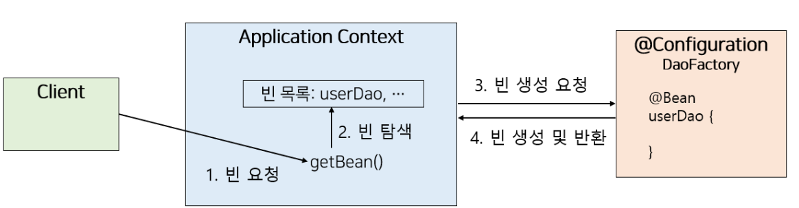

# IOC, DI, Spring Bean

<aside>
💡

Spring Framework의 객체 지향을 위한 도구들을 알아보자

</aside>

# IOC & DI

### #IOC와 DI

**IOC는 객체의 제어권을 개발자가 아닌 프레임워크에 위임**하는 것이고, **DI는 IOC를 구현하기 위해서 여러 방법을 통해 객체의 의존 관계를 외부에서 주입**함으로써 객체 간 결합도를 줄이는 방법이다.

→ 개발자가 직접 객체의 의존 관계를 설정하지 않기 때문에 순환 참조와 같은 실수를 줄이고, 다형성을 활용하여 변화에 유연하게 대처 가능하다.

먼저 간단한 예제를 보자.

```java
// 1. A가 사용할 메서드를 인터페이스에 선언해 놓자.
interface I{
	void example();
}

class A{
		// 3. I 인터페이스 타입의 필드를 선언해준다.
		private I i;
		// 4. 생성자를 통해 외부에서 i의 인스턴스를 받아와 i를 초기화 해준다. (다형성)
		public A(I i){
			this.i = i;
		}
		// 5. 외부에서 받아온 인스턴스의 메서드를 호출한다.
		public void exampleLogic(){
			i.example();
		}
}
// 2. A가 사용하는 메서드를 가진 객체들이 I를 구현하도록 한다.
class B implements I{
		public void example(){
		// logic
		}
}
class C implements I{
		public void example(){
			// logic
		}
}
```

위 예제를 보면 A는 자신이 사용할 객체를 스스로 생성하지 않고, 외부로부터 받아와서 사용하고 있는 것을 알 수 있습니다. A는 그저  i의 인스턴스에 example() 메서드가 있음을 인지하고 있습니다. 

그렇다면 **누군가가 A가 사용할 객체를 결정하고, 생성하여 A가 인스턴스화 될 때 인자로 전달해주어야 하는데, 이를 스프링이 해줍니다.**

**이렇게 개발자가 아닌 스프링이 사용할 객체를 생성하여 의존 관계를 맺어주는 것을 IoC(Inversion of Control, 제어의 역전) 라고 하며,** 그 과정에서 **여러 방법을 통해 외부에서 객체를 주입해주는 것을 DI(Dependency Injection, 의존성 주입) 라고 합니다.**

의존성 주입에는 3가지 정도의 방법이 있습니다.

### **#객체 주입 방법**

**생성자 주입**

```java
@Controller
class BookController{
	private final Bookservice bookservice;
	
	BookController(BookService bookservice){
		this.bookservice = bookservice;
	}
	//logic
}
```

- @RequiredArgsConstructor를 통해서도 주입 가능
- 클래스의 생성자가 하나이고, 그 생성자로 주입 받을 객체가 빈으로 등록되어 있다면  @Autowired를 생략 할 수 있습니다.
- 가장 권장하는 방법이다.
    - 코드 상에서 순환 참조가 일어나면 BeanCurrentlyInCreationException 을 통해 에러를 감지 할 수 있다.
    - final 키워드를 통해 변경의 가능성을 배제 할 수 있다. (SOLID 원칙 중 개방-폐쇄의 원칙)을 따를 수 있다.

**필드 주입**

```java
@Controller
class BookController{
	@Autowired
	Bookservice bookservice;
	
	//logic
}
```

- 단점
    - 빈이 생성된 후에 참조를 하기 때문에 실제로 코드가 호출 되기 전까지 순환 참조의 오류를 인지 할 수 없다.
    - null이 주입 될 우려가 있다.

**setter 주입**

```java
@Controller
class BookController{
	
	Bookservice bookservice;
	@Autowired
	public void SetBookService(Bookservice bookservice;){
    	this.bookservice= bookservice
	}
	//logic
}
```

- 단점
    - 빈이 생성된 후에 참조를 하기 때문에 실제로 코드가 호출 되기 전까지 순환 참조의 오류를 인지 할 수 없다.
    - public 을 통해 set 메서드를 열어두어야 하기 때문에 변경의 여지가 있다.

# application context &Spring Bean과 생명주기

> 위에서 언급되었듯, 스프링은 **객체의 결정, 생성, 주입을 대신 수행**해주고 있습니다.
그렇다면 스프링은 어떻게  이를 수행하고 있을까?
> 

### #application context

Spring에는 빈의 생성과 관계 설정 같은 제어를 담당하는 IOC 컨테이너인 빈 팩토리(Bean Factory)가 존재하는데, 실제로는 이외의 추가 설정을 위해 **빈 팩토리를 상속받아 확장시킨 application context를 사용하여 객체(bean)를 관리**합니다.

application context는 **객체의 생성 및 연관 관계 정보를 읽고 처리**한다. 예를 들어 @Configuration과 같은 어노테이션이 붙은 class의 정보를 읽는 것이다.

### #Bean

스프링은 bean이라는 개념으로 객체를 제어합니다.

bean이란 **스프링 컨테이너가 관리하는 자바 객체**를 말합니다. 

### #Bean 등록 방법

application context가 관리할 bean들을 등록하는 방법.

1. **Component Scaning**
    1. @ComponentScan을 통해 @Component가 붙은 클래스들을 모두 Bean 등록한다.
    2. 모두가 사용하는 @Controller, @Service 등도 @Component가 붙은 어노테이션이다.
2. **XML설정 파일 혹은 자바 설정을 통한 등록**
    1. 자바 설정의 경우 @Configuration을 통해 직접 등록하는 방법이다.
    
    ```java
    @Configuration
    public class TestConfig{
    	@Bean
    	public TestController testController(){
    		return new TestController();
    	}
    }
    ```
    

이제 bean이 등록되었고, 관리가 되고 있는 bean 요청 시에는 어떤 과정을 거치는지 간단히 알아보자. 

### #Bean 요청 시 처리 과정

- **실제 Bean 요청 순간은 Spring이 애플리케이션을 초기화하면서 의존성을 주입할 때 발생**



1. 클라이언트가 getBean()을 통해 빈을 요청
2. application Context가 빈 목록( bean 등록 방법으로 등록된 bean들)에 요청한 빈이 존재하는지 확인
    1. @Scope("singleton")이면 기존 인스턴스를 반환.
    2. @Scope("prototype")이면 새로운 인스턴스를 생성.
3. 빈이 없으면 생성하고 관리
    1. `@Bean` 메서드 실행 or Reflection을 사용해 객체 생성.
    2. 생성자 주입, 필드 주입 등으로 **의존성 주입 진행**.

### #Bean의 생명주기


1. 빈 등록
2. 빈 인스턴스화 및 의존성 주입 (위에서 언급한 bean 요청 시 처리 과정에 해당)
3. 스프링 `Aware` 동작에 대한 검사 및 호출 (특정 빈이 자신을 생성하고 관리하는 ApplicationContext에 접근할 때 사용)
4. 빈 생성 콜백 메서드 호출
    1. `@PostConstruct` 메서드에 사용
    2. `InitializingBean` 인터페이스 구현
    3. `initMethod` @Bean 사용 시 옵션으로 적용
5. 빈 소멸 콜백 메서드 호출
    1. `@PreDestroy` 
    2. `DesposableBean`
    3. `destroyMethod`

**중요한 점은 빈 객체가 생성되어 의존성이 모두 주입 되고 나서, 콜백 메서드들이 실행된다는 것.**

- **빈이 만들어지고 의존성이 주입된 후 → `@PostConstruct` 실행.**
- **ApplicationContext가 닫히기 직전 → `@PreDestroy` 실행.**

💡 **추가로 싱글톤(`@Scope("singleton")`) 빈에서만 적용됨!**

(`@Scope("prototype")`인 경우 `@PreDestroy`가 호출되지 않음) 🚀

( 자세한 생성 및 소멸 콜백과 관련된 내용을 알고 싶다면 [Ref.](https://www.notion.so/IOC-DI-Spring-Bean-18ddda0d6ba28031bdc9f4280c14e58a?pvs=21)를 참고하길 바란다.)

### 더 알아가기.

- [Reflection API](https://www.notion.so/IOC-DI-Spring-Bean-18ddda0d6ba28031bdc9f4280c14e58a?pvs=21)

## Ref.

https://www.codestates.com/blog/content/%EC%8A%A4%ED%94%84%EB%A7%81-%EC%8A%A4%ED%94%84%EB%A7%81%EB%B6%80%ED%8A%B8 

https://dev-coco.tistory.com/70

https://github.com/binghe819/TIL/blob/master/Spring/Core/bean%20lifecycle/bean%20lifecycle.md#%EB%B9%88-%EC%83%9D%EB%AA%85%EC%A3%BC%EA%B8%B0

https://velog.io/@vpdls1511/Spring-Bean%EC%9D%B4%EB%9E%80-%EB%AC%B4%EC%97%87%EC%9D%B8%EA%B0%80