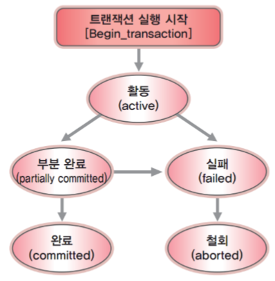

# 동시성 제어와 트랜젝션

<aside>
💡

동시성 제어는 다중 사용자 환경에서 둘 이상의 트랜잭션이 수행될 때, 일관성을 해치지 않도록 하는 기법이다. 
데이터베이스에서 동시성 문제가 발생하는 이유는 여러 트랜잭션이 동시에 실행되기 때문입니다. 트랜잭션은 데이터의 일관성을 유지하기 위한 논리적 작업 단위이며, 이 과정에서 동시성 문제를 해결하는 것이 매우 중요하다. 

이 글에서는 트랜잭션이 무엇인지와 동시성 제어 주요 방식을 중점적으로 전달하려고 한다.

</aside>

## [동시성 제어를 이해하기 위한 기본 개념 : 트랜잭션]

**트랜잭션이란?**

> DBMS에서 데이터를 다루는 논리적 단위
> 

우리는 데이터베이스를 다룰 때 삽입, 수정, 삭제 등의 작업을 수행하는데 이 여러 개의 작업들을 하나의 트랜잭션으로 묶는다. 즉, DBMS에서 데이터를 다루는 논리적 작업 단위가 된다.

 예를 들어 계좌에 돈을 송금하는 과정을 떠올려보자. 계좌가 송금되는 과정은 아래와 같을 것입니다.

1. A계좌에서 돈을 인출
2. B계좌에 돈을 입금

위 두 과정은 반드시 하나의 작업으로 이루어져야 합니다. 만약 A계좌에서 돈은 빠져나갔는데 B 계좌에 돈이 입금되지 않으면 데이터의 일관성이 깨지겠죠.

따라서 위의 송금하는 과정을 하나로 묶어서 처리해야 합니다. 송금이  성공적으로 모두 끝나면 성공, 송금 도중에 오류가 생긴다면 없었던 일로 만들어야겠죠. 

이렇게 쪼갤 수 없는 작업 처리 단위를, 트랜잭션이라고 합니다.

---

## [트랜잭션 5가지 상태]



> 활동(Active) : Begin_transaction으로 실행되어 트랜잭션이 실행 중인 상태
실패(Falied) : 트랜잭션 도중 장애가 발생하여 중단된 상태  
철회(Aborted) : 트랜잭션이 비정상 종료되어 RollBack을 수행한 상태
부분 완료(Partially Committed) : 마지막 명령문을 실행시킨 직후의 상태이며 실패, 혹은 완료 상태로 전이된다.
완료(Committed) : 성공적으로 트랜잭션이 완료된 상태
> 

---

## [트랜잭션의 특징] (ACID)

데이터베이스 트랜젝션이 안전하게 수행된다는 것을 보장하기 위한 특징들이 있습니다.

- 원자성(Atomicity) : 트랜잭션에 포함된 작업은 전부 수행되거나 전부 수행되지 않아야 한다.
    - ex) 계좌 송금 예제
- 일관성(Consistency) : 트랜잭션을 수행하기 전이나 후나 데이터베이스는 항상 일관된 상태를 유지해야 한다. 이를 위해 동시성 제어가 존재
    - ex) A에서 B로 송금시 A와 B의 돈의 총 합은 같아야 한다
- 고립성(Isolation) : 수행 중인 트랜잭션에 다른 트랜잭션이 끼어들어 변경중인 데이터 값을 훼손하지 않아야 한다. 이를 위해 동시성 제어가 존재
    - ex) 수량이 10개인 물품을 2명이 하나씩 구매한다고 할 때, 2명 모두 10개인 순간을 select하고 update를 하면 2개가 줄지 않고 1개만 줄어든다.
- 지속성(Durability) : 수행을 성공적으로 완료한 트랜잭션은 변경한 데이터를 영구히 저장해야 한다.
    
    ---
    

## [동시성 문제]

**읽기 + 쓰기 트랜젝션 문제**

- **Dirty Read(오손 읽기)**: 트랜잭션이 완료되지 않은 데이터를 다른 트랜잭션이 읽는 경우
- **Non-repeatable Read(반복 불가능 읽기)**: 동일한 데이터를 두 번 읽을 때 값이 달라지는 경우
- **Phantom Read(유령 데이터 읽기)**: 트랜잭션 중간에 데이터가 추가되거나 삭제되어 쿼리 결과가 달라지는 경우

**쓰기 + 쓰기 트랜젝션 문제**

- **Lost Update (갱신 손실):** 하나의 트랜잭션이 갱신한 내용을 다른 트랜잭션이 덮어씀으로써 갱신이 무효화 되는 경우
- **Inconsistency(모순성) :** 다른 트랜잭션들이 해당 항목 값을 갱신하는 동안 한 트랜잭션이 두 개의 항목 값 중 어떤 것은 갱신되기 전의 값을 읽고 다른 것은 갱신된 후의 값을 읽게 되어 데이터의 불일치가 발생하는 상황
- **Cascading Rollback(연쇄 복귀) :** 한 트랜잭션이 데이터를 갱신한 다음 실패하여 Rollback 연산을 수행하는 과정에서 갱신과 Rollback 연산을 실행하고 있는 사이에 해당 데이터를 읽어서 사용할 때 발생할 수 있는 문제

---

## [동시성 제어의 주요 방식]

**깊게 공부하기 위한 예제를 직접 테스트 해볼 필요가 있음**

- synchronized의 경우)
    - @transactional과 사용할 수 없는 이유
        - @trancational이 적용된 메서드는 spring이 트랜잭션 처리를 위해 프록시 패턴을 적용시키기 때문
        - 트랜잭션을 위한 프록시 객체는 sychronized가 상속되지 않아 여러 스레드의 접근을 제한 할 수 없다.
        - → 또한 내부 호출 시에는 프록시 객체가 생성되지 않음
    - 또한 분산 환경에서 사용할 수 없음 ( 한 프로세스 내의 쓰레드는 제어하지만 서로다른 프로세스는 제어하지 못한다. )
    - 그래서? 낙관락 or 비관락 or 분산락을 이용하자의 이야기

## #1 Application Level

- 설명 : 애플리케이션 코드에서 직접 동시성을 제어합니다.
- 장점 : 데이터베이스에 의존하지 않고 간단히 구현 가능
- 단점 : 분산 환경에서의 적용이 어렵고 코드의 복잡성이 증가
- 예제 : Synchronized 키워드를 활용한 동시성 제어

```java
//@Transactional
public synchronized void decrease(Long id, Long quantity) {
    Stock findStock = stockRepository.findById(id).orElseThrow();
    
    findStock.decrease(quantity);
  
    stockRepository.saveAndFlush(findStock);
}
```

> 위와 같이 활용하며 @Transactional과 함께 사용하게 되면 동시성 제어가 불가능하다.
또한 분산 환경에서는 제어가 힘들다. synchronized 키워드는 한 프로세스 내에서 한번에 하나의 스레드만 메서드 접근을 보장할 수 있기 때문에 두 개 이상의 프로세스를 사용한다면 동시성을 제어할 수 없는 것이다.
> 

결국 애플리케이션 레벨이 아닌 데이터 베이스 레벨에서의 동시성 제어가 필요하다.

## #2 Database Lock

- 설명 : 데이터 베이스 레벨에서 Lock기능을 활용하여 데이터에 직접 락을 적용, 동시성을 제어한다.
- 기법 :
    - **Optimistic Lock(낙관적 락)** : 버전 번호를 활용해 충돌 감지
    - **Pessimistic Lock(비관적 락)** : 데이터에 대한 Lock을 먼저 걸고 작업 수행
- 장점 : 데이터의 일관성과 고립성을 강력하게 보장
- 단점 : 성능 저하 및 교착 상태 발생 가능

### **[Optimistic Lock]**

**트랜잭션이 대부분이 충돌하지 않는다고 낙관적으로 가정하는 방법**이다.
데이터베이스의 실제 락을 사용하는 것이 아닌 SQL쿼리에서 **버전 정보을 확인**함으로써 데이터를 조회, 수정할 수 있는지 결정된다.

**동작 과정**

1. 트랜잭션 `T1`이 데이터를 읽는다.
2. 트랜잭션 `T2`가 데이터를 읽는다.
3. `T1`이 데이터를 수정할 때, **`version`을 1만큼 증가 시킨다.**
    - 데이터의 version은 **1에서 2로 변경**된다.
4. `T2`가 데이터를 수정하려고 한다.
    - T2가 읽은 데이터의 version은 `1`이므로, `WHERE`절의 조건 역시 `version = 1`이다.
    - **이미 `T1`에 의해 version이 `2`로 변경되었으므로, 데이터 수정에 실패하고 예외(*OptimisticLockException*)가 발생한다.**

**주의할 점**

트랜잭션 커밋 시 버전 정보가 달라 생기는 예외에 대한 **예외 처리를 필수**로 해주어야 한다. 
**비즈니스 예외 상황이 아님**에도 요청에 실패할 수 있기 때문이다.

사용자는 정상적인 요청을 했음에도 요청에 실패하게 되면 안되니까요.
따라서 낙관적 락에 의해 예외가 생기면 예외가 발생했던 로직을 재 수행 해야한다.

**구현방법**

1. 필드에 @Version을 적용
    
    ```java
    @Entity
    @Geeter
    @NoArgsConstructor
    public class Stock{
    	private Long id;
    	@Version
    	private Long version;
    }
    ```
    
2. JPA가 제공하는 락 옵션 중 하나인 OPTIMISTIC
 ****`OPTIMISTIC`을 비롯한 락 옵션들은 `javax.persistence.LockModeType`에 정의되어있다.) Spring Data JPA를 사용하는 경우 `org.springframework.data.jpa.repository.Lock` 어노테이션을 이용하여 간단하게 지정 가능하다.
    
    ```java
    // Repository
    public interface Repository extends JpaRepository<Stock, Long> {
    
      @Lock(value = LockModeType.OPTIMISTIC)
      @Query("select s from Stock where s.id = :id")
      Optional<Entity> findByIdWithOptimisticLock(@Param(value = "id") Long id);
    
    }
    ```
    
- 가독성 면에서 필드에 @Version을 사용하는것 보다  OPTIMISTIC을 사용하는 것이 낫다. 서비스 객체에서 낙관적 락을 사용되는 것인지 인지 할 수 있기 때문이다.
    
    

**단점**

1. 개발자가 재시도 로직을 직접 작성해야 한다.
2. 충돌이 많아짐에 따라 비용이 증가한다.
    1. 충돌이 많아짐에 따라 재시도 로직을 실행하기 때문

### **[Pessimistic Lock]**

비관적 락은 **트랜잭션의 충돌이 발생한다는 가정**하고, 데이터에 우선 락을 걸어 놓는 방식이다.

**동작과정**

- `트랜잭션 T1` 트랜젝션이 데이터를 조회할 때, 배타락을 건다.
    - mysql의 InnoDB엔진의 경우 `select for update`를 사용해서 경우 행 수준 잠금을 건다.
- `트랜잭션 T2`가 데이터를 조회하려고 했으나, 배타락이 걸려 있어 조회가 불가능하다.
    - `T2`는 데이터의 락이 해제될 때까지 대기한다.
- `T1`이 데이터를 수정하고, 커밋 한다.
- `T2`가 데이터를 조회할 때, 배타 락을 건다.
- `T2`가 데이터를 수정하고, 커밋 한다.

**구현방법**

낙관 락과 마찬가지로 비관적 락은 org.springframework.data.jpa.repository.Lock 어노테이션을 사용하여 락을 지정해 줄 수 있다.

```java
// Repository
public interface Repository extends JpaRepository<Stock, Long> {
	/**
   * PESSIMISTIC_READ : 조회되는 레코드에 공유락을 건다.
   * PESSIMISTIC_WRITE : 조회되는 레코드에 배타락을 건다.
	*/
  @Lock(value = LockModeType.PESSIMISTIC_WRITE)
  @Query("select s from Stock where s.id = :id")
  Optional<Entity> findByIdWithPessimisticLock(@Param(value = "id") Long id);
}
```

**충돌이 많은 경우에는 충돌 시 로직을 재수행해야 하는 낙관적 락보다, 락을 획득할 때까지 대기하는 비관적 락이 보다 적합하다.** 상황에 따라 적절히 사용해야 할 것이다.

**비용문제 →** 

**단점**

- **데드락**의 가능성이 있다.
    - 두 개 이상의 트랜잭션이 각자 데이터에 대해 락을 점유하고 있는 상태에서 서로 상대 트랜잭션의 락 해제를  대기하고 있는 상황

## #3 Redis Distribued Lock

- 설명 : Redis를 활용한 Lock을 적용한다. 분산 환경에서 **간단한 락** 부터 **고도화된 락**까지 **여러 방법**으로 구현 가능하다. 또한 구현체에 따라 다양한 환경과 비즈니스에 적합하게 적용 시킬 수 있다.
- 장점 : 분산 환경에서 동시성을 제어 할 수 있다.
- 구현 방법 :
    1. **setnx명령어 활용**
        1. *“락이 존재하는지 확인한다”*, *“존재하지 않는다면 락을 획득한다”* 두 연산이 atomic하게 이루어져한다. 레디스는 *“값이 존재하지 않으면 세팅한다”* 라는 `setnx` 명령어를 지원
    2. **setIfAbsent()를 활용** 
        1. setnx와 TTL이 랩핑 되어 있는 SpringDataRedis가 제공하는 명령어
        2. setnx 명령어와 예제가 동일 
        3. TTL(time to live)을 설정할 수 있기 때문에 setnx명령어의 타임 아웃이 없는 단점을 보완할 수 있다.
        
        ```java
        Boolean lockAcquired = redisTemplate.opsForValue().setIfAbsent(lockKey, lockValue, Duration.ofSeconds(10));
        if (lockAcquired) {
            try {
                // Critical section
            } finally {
                redisTemplate.delete(lockKey); // 락 해제
            }
        }
        ```
        
    3. **Redisson 라이브러리를 활용**
        1. Redis 기반 분산 락을 더 안전하고 편리하게 사용할 수 있도록 기능을 제공한다.
        2.  락 해제시 해당 사용자만 해제할 수 있도록 value를 비교하는 로직이 필요한데, setIfAbsent()를 활용하는 경우 이를 원자적으로 처리할 수 없다. Redisson은 이를 원자적으로 처리 가능한 메소드를 제공한다.
        3. tryLock()과 같은 메소드를 제공
        
        ```java
        // RedissonLock의 tryLock 메소드 시그니쳐
        public boolean tryLock(long waitTime, long leaseTime, TimeUnit unit) throws InterruptedException
        /*
        waitTime : 해당 시간 만큼 시간이 지나면 false를 반환 (락 획득 실패)
        leaseTime : 해당 시간 만큼 시간이 지나면 락을 자동 해제
        unit : 시간 단위
        */
        ```
        
        1. RLock 인터페이스를 통해 락 획득, 해제, TTL관리, 데드락 방지등을 처리할 수 있다.
        
        ```java
        RLock lock = redisson.getLock("myLock");
        try {
            if (lock.tryLock(10, 5, TimeUnit.SECONDS)) {
                // Critical section
            } 
        } finally {
            if (lock.isHeldByCurrentThread()) {
                lock.unlock(); // 락 해제
            }
        }
        //내부적으로 lua 스크립트를 활용하여 원자적 동작 수행함으로 안적적으로 락을 관리
        ```
        

### 그래서 어떤 방식을 사용해야 할까?

지식 공유자 “최상용”님의 답변을 인용하면


순간적인 트래픽이 많은지에 따라 다르겠다. 즉, 충돌이 많이 일어난다면 비관락과 redis를 활용한 분산락, 충돌이 많지 않다면 낙관락을 사용하는 것이 적절하겠다.

실제로 어느 정도 **충돌이 일어날지 판단이 어렵**다면 **낙관락**으로 서비스를 진행한 이 후에 부하에 따라 **비관락** 혹은 **분산락**을 ****적용하는 것도 좋을 것 같다.   

### Ref.

https://www.inflearn.com/course/%EB%8F%99%EC%8B%9C%EC%84%B1%EC%9D%B4%EC%8A%88-%EC%9E%AC%EA%B3%A0%EC%8B%9C%EC%8A%A4%ED%85%9C

https://mangkyu.tistory.com/30

https://velog.io/@balparang/Transactional%EA%B3%BC-synchronized%EB%A5%BC-%EA%B0%99%EC%9D%B4-%EC%82%AC%EC%9A%A9%ED%95%A0-%EB%95%8C%EC%9D%98-%EB%AC%B8%EC%A0%9C%EC%A0%90

https://velog.io/@balparang/%EB%82%99%EA%B4%80%EC%A0%81-%EB%9D%BD%EA%B3%BC-%EB%B9%84%EA%B4%80%EC%A0%81-%EB%9D%BD%EC%9D%80-Race-Condition%EC%9D%84-%EC%96%B4%EB%96%BB%EA%B2%8C-%ED%95%B4%EA%B2%B0%ED%95%98%EB%8A%94%EA%B0%80

https://hyperconnect.github.io/2019/11/15/redis-distributed-lock-1.html